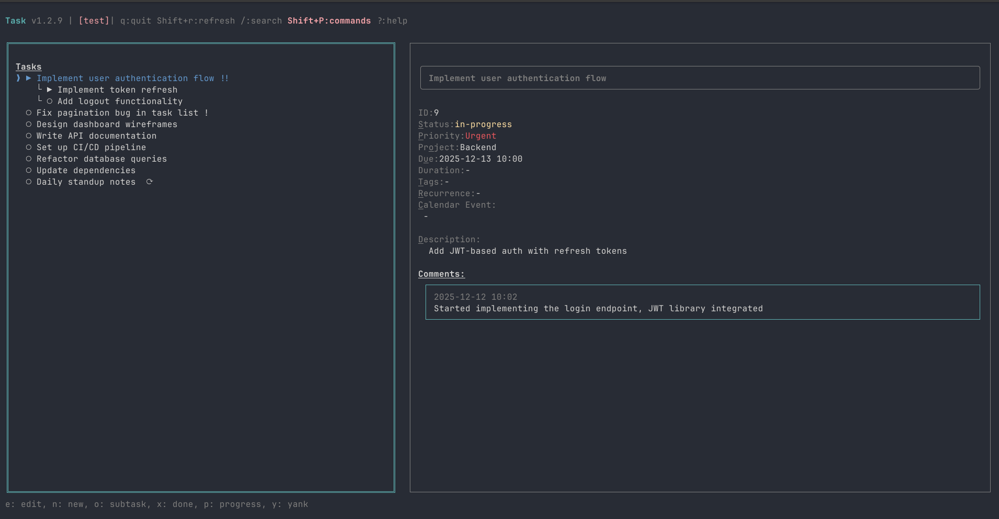

# Task

**The AI-first task manager.** Semantic search, agent-friendly APIs, and a TUI
that stays out of your way.



## The Problem

Task managers weren't built for AI. You can't pipe tasks to Claude, search by
meaning, or batch-create from parsed text. When you need your AI assistant to
manage tasks, you're stuck copying and pasting.

## The Solution

Task bridges humans and AI agents. A clean CLI for scripts, an interactive TUI
for focus, and an HTTP API that speaks JSON. Search tasks by meaning, not
keywords. Create dozens of tasks in one call. Every feature works for both you
and your AI tools.

## Key Features

- **Semantic Search** — find tasks by meaning, not just keywords
- **Agent Integration** — JSON output, batch operations, context metadata
- **Recurring Tasks** — natural language patterns ("every Monday", "1st of
  month")
- **Google Calendar** — one-way sync keeps your calendar current
- **Multiple Interfaces** — CLI for scripts, TUI for focus, API for agents
- **Local-first** — SQLite database, your data stays yours

## Claude Code Integration

Task CLI includes a
[Claude Code skill](https://www.anthropic.com/engineering/equipping-agents-for-the-real-world-with-agent-skills)
for natural language task management. Once installed, just ask:

> "Add a task to review PR #42, due tomorrow"

> "What tasks are overdue?"

> "Show me all tasks related to authentication"

**Install in Claude Code:**

```
/plugin marketplace add lauriliivamagi/task
/plugin install task-assistant@task
```

See [How to Use the Claude Code Skill](docs/how-to/claude-code-skill.md) for
details.

## Quick Start

### Install

**From GitHub Releases (recommended):**

```bash
# Download the latest binary for your platform
curl -L https://github.com/larr/larr-task/releases/latest/download/task-linux-x86_64 -o task
chmod +x task
sudo mv task /usr/local/bin/
```

**With Deno:**

```bash
deno install --global -A --name task --config deno.json src/main.ts
```

**From source:**

```bash
git clone https://github.com/larr/larr-task.git
cd larr-task
deno task compile  # Creates ./task binary
```

### Your First Tasks

```bash
# Create a task
task add "Review PR #42" --due tomorrow --tag review

# List active tasks
task list

# Search by meaning (requires embedding provider)
task list --semantic "authentication bugs"

# Launch the TUI
task tui
```

## Interfaces

### CLI

Run `task --help` for all commands. Common operations:

```bash
task add "Title" --project Work --due "next friday"
task list --status in-progress
task update 42 --status done
task view 42
```

See [CLI Reference](docs/reference/cli.md) for complete documentation.

### TUI

Launch with `task tui`. Navigate with vim-style keys or arrows.

| Key       | Action             |
| --------- | ------------------ |
| `j/k`     | Move up/down       |
| `n`       | New task           |
| `x`       | Toggle done        |
| `e`       | Edit title         |
| `Tab`     | Switch panels      |
| `Shift+P` | Command palette    |
| `?`       | Show all shortcuts |
| `q`       | Quit               |

Shortcuts are customizable via `~/.task-cli/config.json`.

### HTTP API

Start the server:

```bash
task serve --port 3000
```

The API supports all task operations. See [CLAUDE.md](CLAUDE.md) for endpoint
documentation.

## Configuration

Configuration lives in `~/.task-cli/config.json`:

```json
{
  "logLevel": "info",
  "work": {
    "repos_dir": "~/git",
    "ide_command": "claude"
  }
}
```

**Environment variables** override config:

```bash
TASK_CLI_LOG_LEVEL=debug
EMBEDDING_PROVIDER=ollama    # or openai, gemini
OPENAI_API_KEY=sk-...        # for OpenAI embeddings
```

**Data storage:**

```
~/.task-cli/
├── config.json       # Configuration
├── databases/        # SQLite databases (multi-db support)
├── logs/             # Daily rotated logs
└── templates/        # Task sharing templates
```

## Semantic Search Setup

To search by meaning, configure an embedding provider:

```bash
# Ollama (local, free)
export EMBEDDING_PROVIDER=ollama

# OpenAI
export EMBEDDING_PROVIDER=openai
export OPENAI_API_KEY=sk-...

# Google Gemini
export EMBEDDING_PROVIDER=gemini
export GEMINI_API_KEY=...
```

Then backfill embeddings and search:

```bash
task embeddings backfill
task list --semantic "urgent customer issues"
```

## Documentation

### Tutorials

Step-by-step lessons to get you started:

- [Quick Start](docs/tutorials/quick-start.md) — your first tasks in 5 minutes
- [AI Integration](docs/tutorials/ai-integration.md) — use with Claude Code and
  AI assistants

### How-to Guides

Solve specific problems:

- [How to Use the Claude Code Skill](docs/how-to/claude-code-skill.md)
- [How to Create Recurring Tasks](docs/how-to/recurring-tasks.md)
- [How to Sync to Google Calendar](docs/how-to/google-calendar.md)
- [How to Set Up Semantic Search](docs/how-to/semantic-search.md)
- [How to Manage Multiple Databases](docs/how-to/multiple-databases.md)
- [How to Sync Across Devices](docs/how-to/git-sync.md)
- [How to Customize TUI Shortcuts](docs/how-to/customize-tui.md)

### Reference

Complete technical documentation:

- [CLI Reference](docs/reference/cli.md) — all commands and options
- [HTTP API Reference](docs/reference/api.md) — REST API endpoints
- [Configuration Reference](docs/reference/configuration.md) — config file and
  environment variables
- [Keyboard Shortcuts](docs/reference/keyboard-shortcuts.md) — TUI shortcuts

### Explanation

Understand the design:

- [Architecture](docs/explanation/architecture.md) — system design and
  components
- [Local-First Design](docs/explanation/local-first.md) — why your data stays
  local
- [How Semantic Search Works](docs/explanation/semantic-search.md) — embeddings
  and vectors

### For Developers

- [Developer Guide](CLAUDE.md) — architecture, testing, and contributing

## License

MIT
